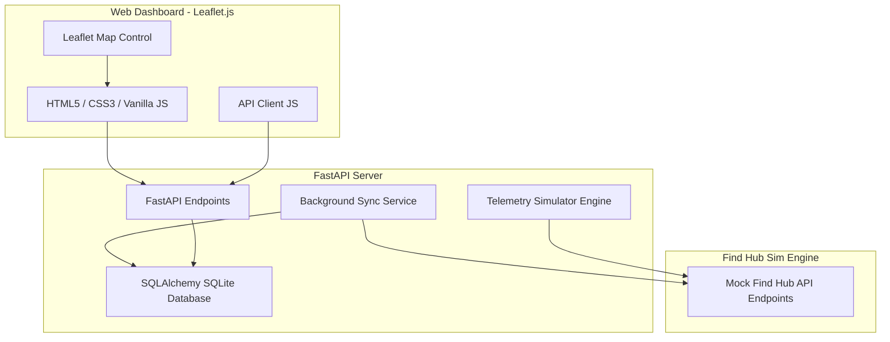

# GPS Device Monitoring Dashboard Implementation Plan

## Goal Description

The project objective is to design and develop a web-based GPS device monitoring dashboard that retrieves location data from a simulated **Google Find Hub REST API** and visualizes it on an interactive map using a non-Google map provider (**OpenStreetMap** via **Leaflet.js**). 

The dashboard provides real-time tracking, location history playback, geofence management, device registry/administration, telemetry analytics, and user role management, tailored to simulate communication tags like the **MAK Location Tracker Smart**.

---

## User Review Required

> [!IMPORTANT]
> **No Public Google Find Hub API:** As there is no public REST API for Google Find My Device (due to privacy/security restrictions), the backend will include a complete mock server mimicking the Google Find Hub REST API.
> **Python/FastAPI Stack:** Since Node/npm are not installed on the system but Python 3.11 is present, the entire backend and static file hosting will be built with **Python FastAPI** and **Uvicorn** using a SQLite database.

> [!TIP]
> **Simulation Control:** The dashboard will feature a simulator controller panel in the UI, enabling users to trigger routes, adjust speeds, toggle device online/offline states, and trigger geofence alerts dynamically. This will make testing and demonstrating features extremely easy.

---

## Open Questions

1. **Geographic Focus:** I have selected coordinates around NCR (New Delhi, Gurgaon, Noida) for the default device simulation paths, as the workspace is named "Airtel". Do you prefer a different set of coordinate zones (e.g., Bangalore, Mumbai, or international)?
2. **Device Features:** The MAK Location Tracker Smart is a Bluetooth-based item finder. Should we simulate battery levels, signal strength (RSSI), and connection status (e.g., connected via phone, disconnected, last active)?

---

## Proposed System Architecture

A modular monorepo architecture implemented in Python and Vanilla CSS/JavaScript.



---

## Database Schema

We will use SQLite (`gps_dashboard.db`) with the following tables:

### 1. `users`
Tracks authorized users, passwords, and roles:
- `id` (INTEGER, Primary Key)
- `username` (VARCHAR, Unique, Indexed)
- `password_hash` (VARCHAR)
- `role` (VARCHAR) — `Admin`, `Operator`, `Viewer`
- `created_at` (TIMESTAMP)

### 2. `devices`
Registry of tracked devices (representing MAK Smart Finders):
- `id` (INTEGER, Primary Key)
- `hardware_id` (VARCHAR, Unique, Indexed) — MAK MAC address or Find Hub hardware ID
- `name` (VARCHAR) — Friendly name for identification
- `assigned_asset` (VARCHAR) — Asset or user tag
- `status` (VARCHAR) — `online`, `offline`, `moving`
- `battery_level` (INTEGER) — Battery percentage (0-100)
- `last_sync` (TIMESTAMP) — Last synchronization time
- `created_at` (TIMESTAMP)

### 3. `location_history`
GPS coordinates and telemetry logs:
- `id` (INTEGER, Primary Key)
- `device_id` (INTEGER, Foreign Key to `devices.id`, Indexed)
- `latitude` (DOUBLE PRECISION)
- `longitude` (DOUBLE PRECISION)
- `speed` (FLOAT) — Speed in km/h
- `battery_level` (INTEGER)
- `timestamp` (TIMESTAMP, Indexed)

### 4. `geofences`
Geofencing rules to monitor device boundaries:
- `id` (INTEGER, Primary Key)
- `name` (VARCHAR)
- `latitude` (DOUBLE PRECISION)
- `longitude` (DOUBLE PRECISION)
- `radius` (FLOAT) — Radius in meters
- `created_at` (TIMESTAMP)

### 5. `alerts`
System notifications generated by offline state or geofencing crossings:
- `id` (INTEGER, Primary Key)
- `device_id` (INTEGER, Foreign Key to `devices.id`)
- `type` (VARCHAR) — `geofence_exit`, `geofence_entry`, `low_battery`, `offline`
- `message` (TEXT)
- `timestamp` (TIMESTAMP)
- `is_read` (BOOLEAN) — Status flag

---

## API Design

The backend will expose REST endpoints under `/api`:

### 1. Authentication
- `POST /api/auth/login`: Auths user and returns a token/cookie.
- `POST /api/auth/logout`: Clears session.
- `GET /api/auth/me`: Retrieves current user details.

### 2. Devices Management
- `GET /api/devices`: Retrieve all registered devices with their current locations and health.
- `POST /api/devices`: Register a new device.
- `PUT /api/devices/{id}`: Update device details (assignment, name).
- `DELETE /api/devices/{id}`: Deregister device.

### 3. Telemetry & History
- `GET /api/devices/{id}/history`: Retrieve position history for a given start and end timestamp.
- `GET /api/devices/live`: Current locations of all online/active devices.

### 4. Geofences
- `GET /api/geofences`: List all geofences.
- `POST /api/geofences`: Create a geofence.
- `DELETE /api/geofences/{id}`: Delete a geofence.

### 5. Alerts & Analytics
- `GET /api/alerts`: List alerts (with pagination/unread filters).
- `POST /api/alerts/{id}/read`: Mark alert as read.
- `GET /api/analytics`: Overview stats (active count, online percent, alerts list, total distance).

### 6. Mock Google Find Hub & Simulator Controller
- `GET /api/findhub/devices`: Simulated Google Find Hub external API.
- `POST /api/simulator/control`: Control simulation status (toggle routes, speeds, force device offline).

---

## Proposed Changes

We will create a structured project inside `d:\Priya\codes\Airtel` containing:

### Backend Services
#### [NEW] [main.py](file:///d:/Priya/codes/Airtel/main.py)
The entrypoint of the application. Integrates FastAPI routes, sets up CORS, hosts the background task scheduler, and serves static files.

#### [NEW] [database.py](file:///d:/Priya/codes/Airtel/database.py)
SQLAlchemy configuration, SQLite database connection setup, session management, and tables creation.

#### [NEW] [simulator.py](file:///d:/Priya/codes/Airtel/simulator.py)
The core logic for device coordinate generation. Generates paths around Airtel Head Office in Gurgaon and NCR coordinates, simulating speeds, stops, geofence breaches, and battery states.

---

### Frontend Web Client (Static Files)
#### [NEW] [index.html](file:///d:/Priya/codes/Airtel/static/index.html)
The single-page HTML layout containing the dashboard container, maps sidebar, analytics charts, alerts logs, and control panels.

#### [NEW] [style.css](file:///d:/Priya/codes/Airtel/static/style.css)
Custom CSS detailing modern styling variables, a premium dark-themed layout, glowing marker styles, micro-animations, custom dashboards cards, and responsive configurations.

#### [NEW] [app.js](file:///d:/Priya/codes/Airtel/static/app.js)
Bootstrap and coordinate the app states (auth, active screen, interval updates, websocket/polling sync, UI listeners).

#### [NEW] [map.js](file:///d:/Priya/codes/Airtel/static/map.js)
Leaflet map controls: initializing OSM tiles, managing device markers, drawing routes, animating historical replays, rendering geofences, and map interaction.

---

## Verification Plan

### Automated Verification
We will create a lightweight validation test script to verify that:
1. FastAPI app runs successfully and compiles.
2. SQLite tables are automatically initialized.
3. `/api/findhub/devices` and simulator telemetry can be correctly fetched.
4. CRUD operations for devices, geofences, and alerts operate correctly.

```powershell
python -m pytest tests/ (if framework installed) or a direct python test runner python test_backend.py
```

### Manual Verification
1. Run the FastAPI development server:
   ```powershell
   python -m uvicorn main:app --reload --host 127.0.0.1 --port 8000
   ```
2. Navigate to `http://127.0.0.1:8000` in the browser and test:
   - Login as administrator (default credentials: `admin` / `admin123`).
   - Observe real-time device movement on the Leaflet OpenStreetMap dashboard.
   - Test search and filtering of active/offline devices.
   - Use the **Simulator Controller** to toggle geofence crossings, battery alerts, and offline events, verifying visual alert logs and popups.
   - Open **Location History** tab, select a device, choose a date range, and test historical replay.
   - Add/Remove a device and adjust assignments to verify database persistency.
